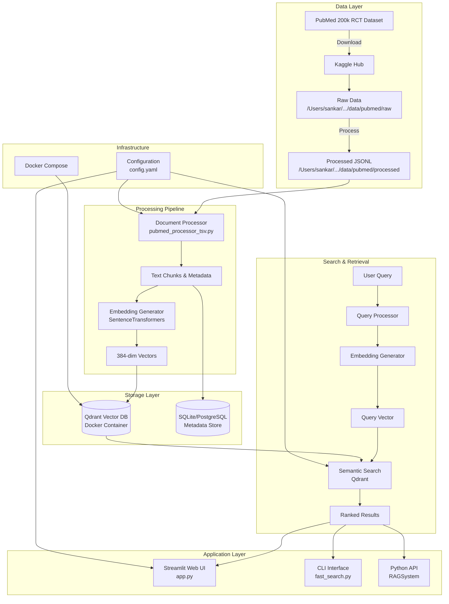
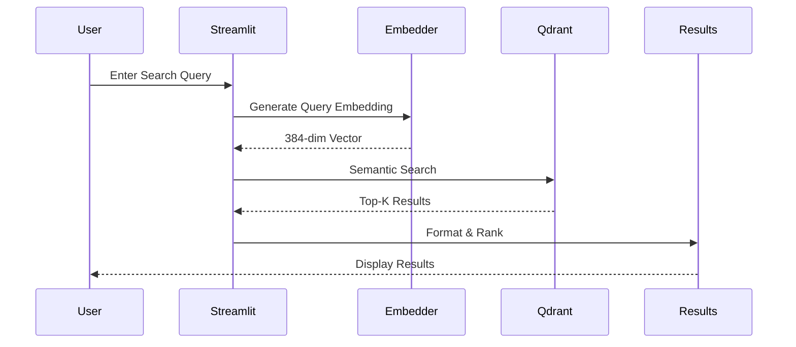

# PubMed Semantic Search - System Architecture

## 📊 Architecture Overview



## 🏗️ System Components

### 1. **Data Pipeline**
```
Kaggle Dataset → Download → Process → Embed → Index → Search
```

### 2. **Technology Stack**
- **Vector Database**: Qdrant (Dockerized)
- **Embeddings**: Sentence-Transformers (all-MiniLM-L6-v2)
- **Web Framework**: Streamlit
- **Processing**: Python with pandas, numpy
- **Container**: Docker & Docker Compose

### 3. **Data Flow**



## 📁 Directory Structure

```
document_search/
├── 📱 Application Layer
│   ├── app.py                    # Streamlit web interface
│   ├── main.py                   # CLI entry point
│   └── run_app.sh               # Application launcher
│
├── 🔧 Scripts/
│   ├── index_pubmed_data.py     # Index documents into Qdrant
│   ├── fast_search.py           # Optimized search interface
│   ├── test_qdrant_connection.py # Qdrant connection tester
│   ├── qdrant_setup.sh          # Docker management script
│   ├── verify_paths.py          # Path verification utility
│   └── cleanup_old_data.sh     # Data cleanup script
│
├── 📦 Source Code (src/)
│   ├── config/
│   │   ├── __init__.py
│   │   └── settings.py          # Configuration management
│   │
│   ├── core/
│   │   ├── __init__.py
│   │   ├── pipeline.py          # Document processing pipeline
│   │   └── rag_system.py        # RAG system interface
│   │
│   ├── data/
│   │   ├── dataset_downloader.py    # Direct download (no API)
│   │   ├── kagglehub_downloader.py  # Kaggle Hub downloader
│   │   ├── download_and_prepare.py  # Main data prep script
│   │   ├── pubmed_processor.py      # JSON processor
│   │   └── pubmed_processor_tsv.py  # TSV processor
│   │
│   ├── processing/
│   │   ├── __init__.py
│   │   └── document_processor.py    # Document chunking
│   │
│   ├── retrieval/
│   │   ├── __init__.py
│   │   ├── base_rag.py          # Base RAG implementation
│   │   └── enhanced_rag.py      # Enhanced RAG features
│   │
│   └── storage/
│       ├── __init__.py
│       ├── database_manager.py   # Database operations
│       └── vector_store.py       # Vector store interface
│
├── 🧪 Tests/
│   ├── __init__.py
│   ├── test_document_search.py
│   ├── test_system.py
│   ├── test_minimal.py
│   └── test_quick.py
│
├── 📚 Examples/
│   ├── process_documents.py
│   ├── query_enhanced_rag.py
│   └── use_local_qdrant.py
│
├── 📐 Configuration/
│   ├── config.yaml              # Main configuration
│   ├── docker-compose.yml       # Docker services
│   ├── pyproject.toml          # Python project config
│   └── .env                    # Environment variables
│
├── 📂 Data/ (Symlinked)
│   └── pubmed -> /Users/sankar/.../data/pubmed/
│       ├── raw/                # Original dataset files
│       └── processed/          # Processed JSONL files
│
└── 🗄️ Storage/
    ├── qdrant_storage/         # Qdrant persistent data
    └── logs/                   # Application logs
```

## 🔄 Data Processing Pipeline

### Stage 1: Data Acquisition
```python
# Download from Kaggle (no API key required)
kagglehub_downloader.py → Downloads dataset
dataset_downloader.py → Alternative downloader
```

### Stage 2: Data Processing
```python
# Process TSV format to JSONL
pubmed_processor_tsv.py:
  - Parse abstracts (###ID format)
  - Extract sections (BACKGROUND, METHODS, etc.)
  - Create structured documents
  - Output: pubmed_200k_rct_processed.jsonl
```

### Stage 3: Embedding & Indexing
```python
# Generate embeddings and index
index_pubmed_data.py:
  - Load documents from JSONL
  - Generate embeddings (384-dim)
  - Batch upload to Qdrant
  - ~550 docs/second
```

### Stage 4: Search & Retrieval
```python
# Semantic search
fast_search.py:
  - Query embedding generation (~66ms)
  - Qdrant search (~2-20ms)
  - Result ranking & filtering
```

## 🚀 Performance Characteristics

| Operation | Time | Details |
|-----------|------|---------|
| Model Loading | ~1.5s | One-time cost |
| First Embedding | ~66ms | Cold start |
| Cached Embedding | <1ms | From cache |
| Qdrant Search | 2-20ms | 195k documents |
| Total Search | ~100ms | First query |
| Total Search (cached) | ~2-3ms | Repeated query |
| Indexing Speed | ~550 docs/s | Batch processing |

## 🔑 Key Features

### 1. **Fast Semantic Search**
- Sub-100ms search latency
- Cosine similarity matching
- HNSW index for scalability

### 2. **Rich Metadata**
- Document sections (Methods, Results, etc.)
- Abstract IDs
- Dataset splits (train/dev/test)

### 3. **Multiple Interfaces**
- Web UI (Streamlit)
- CLI (fast_search.py)
- Python API (RAGSystem)

### 4. **Optimizations**
- Embedding caching
- Batch processing
- Connection pooling
- Progress monitoring

## 📝 Configuration (config.yaml)

```yaml
paths:
  documents:
    processed: /Users/sankar/.../data/pubmed/processed
  datasets:
    pubmed_200k_rct: /Users/sankar/.../data/pubmed/raw

storage:
  qdrant:
    host: localhost
    port: 6333
    collection_name: pubmed_documents

embeddings:
  model: sentence-transformers/all-MiniLM-L6-v2
  device: cpu/mps
  batch_size: 32
```

## 🐳 Docker Services

```yaml
services:
  qdrant:
    image: qdrant/qdrant:latest
    ports:
      - "6333:6333"  # REST API
      - "6334:6334"  # gRPC
    volumes:
      - ./qdrant_storage:/qdrant/storage
```

## 📊 Database Schema

### Qdrant Collection
```
Collection: pubmed_documents
├── Vector Size: 384 dimensions
├── Distance Metric: Cosine
├── Points: 195,654 documents
└── Payload Fields:
    ├── document_id
    ├── abstract_id
    ├── content
    ├── labels[]
    ├── source
    ├── split
    └── section_*
```

## 🎯 Usage Examples

### 1. Index Documents
```bash
# Index subset
uv run python scripts/index_pubmed_data.py --max-documents 1000

# Index all
uv run python scripts/index_pubmed_data.py --recreate
```

### 2. Search Interface
```bash
# Interactive CLI
uv run python scripts/fast_search.py --interactive

# Single search
uv run python scripts/fast_search.py "HIV treatment"

# Web UI
streamlit run app.py
```

### 3. Python API
```python
from scripts.index_pubmed_data import PubMedIndexer

indexer = PubMedIndexer()
results = indexer.search("diabetes treatment", limit=5)
```

## 🔐 Security & Performance

### Security
- Local deployment (no external APIs for search)
- Docker container isolation
- Configurable API keys (optional)

### Performance Optimizations
- Embedding model cached in memory
- Batch processing for indexing
- HNSW index for fast approximate search
- Connection pooling for database
- Lazy loading of resources

## 📈 Scalability

- **Documents**: Tested with 195k+ documents
- **Vectors**: 384-dimensional embeddings
- **Storage**: ~1.5GB for full dataset
- **Memory**: ~2-4GB for operation
- **Search**: Sub-linear scaling with HNSW

## 🛠️ Maintenance

### Regular Tasks
1. Update embeddings model
2. Re-index after data changes
3. Backup Qdrant data
4. Monitor search performance
5. Clear embedding cache

### Monitoring
- Qdrant Dashboard: http://localhost:6333/dashboard
- Search latency tracking
- Collection statistics
- Memory usage

## 📚 Dependencies

### Core
- qdrant-client (Vector DB)
- sentence-transformers (Embeddings)
- streamlit (Web UI)
- pandas (Data processing)

### Infrastructure
- Docker & Docker Compose
- Python 3.9+
- 4GB+ RAM recommended

---

*Last Updated: October 2024*
*Dataset: PubMed 200k RCT*
*Model: all-MiniLM-L6-v2*